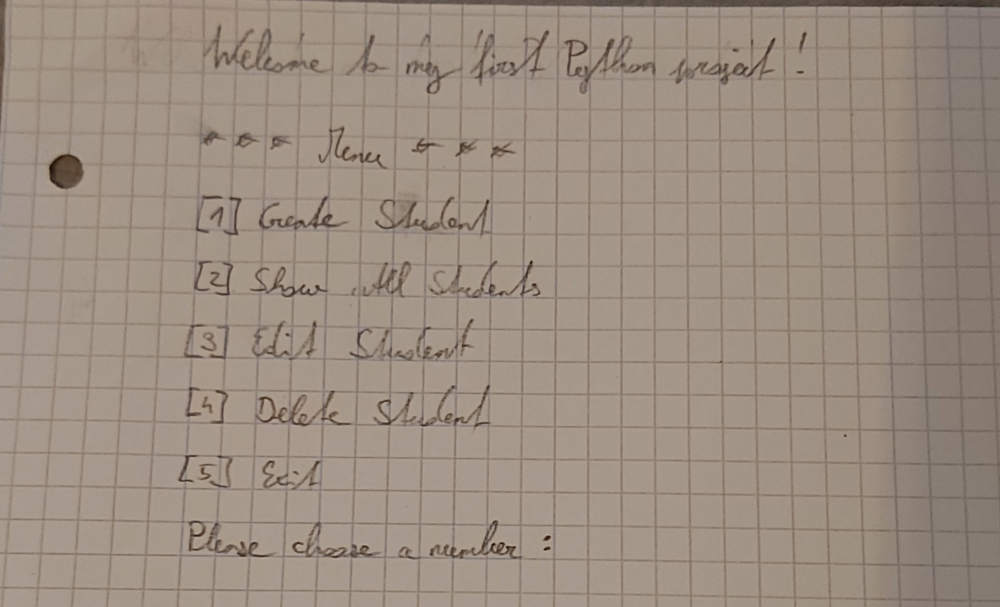

# Python_Intro

Meine Applikation ist ein kleines Student Management System. 

Es werden if-Statements, Schleifen, Funktionen und vieles mehr verwendet.

### Ein User kann:

- Schüler erstellen (Vorname, Nachname, Klasse, Alter)
- alle Schüler anzeigen lassen
- erstellte Schüler bearbeiten
- erstellte Schüler löschen
- kann die Applikation beenden

Nach Beendigung der Applikation, werden die erstellten Schüler in einer csv-Datei gespeichert.

### UI (Scribble):

